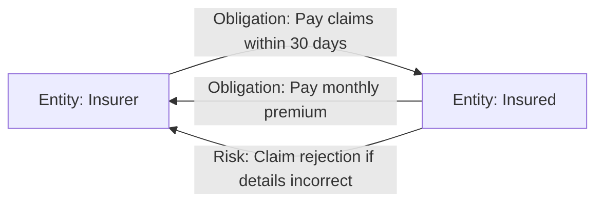
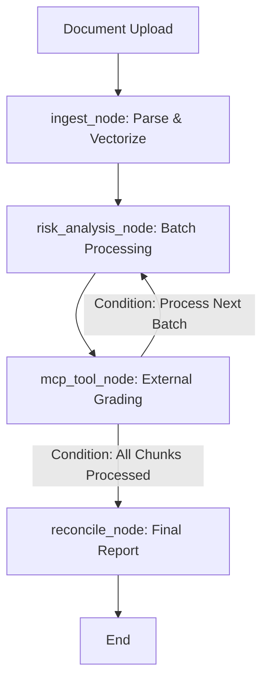

# Document Intelligence Engine & Entity-Relationship Compliance Graph

This repository implements a production-grade GenAI backend for document intelligence. Built entirely without black-box RAG abstractions like LangChain, it orchestrates a **LangGraph agent workflow** exposed over **FastAPI**, with external tool integration via the **Model Context Protocol (MCP)** and comprehensive **structured tracing**.

Instead of relying on generic semantic vector search, this engine builds an **Entity-Relationship Knowledge Graph** from legal and policy documents, modeling document entities as nodes and their governing rules as edges.

---

## 🏛️ Concept: Entities as Nodes, Obligations & Risks as Edges

In legal agreements, the document is naturally structured as a set of rules governing interactions between parties. We model the document as a **knowledge graph** where:
- **Nodes:** Key Entities (e.g., `Insurer`, `Insured`, `Employer`, `Employee`, `Landlord`, `Tenant`).
- **Edges:** The `Obligations` and `Risks` that define the relationship between those entities.



This model powers our **Relational Query Traversal**: When a user asks *"What is the insurer's risk on late claims?"*, the engine traverses the PostgreSQL relational graph to retrieve corresponding `Risk` edges and their corresponding Qdrant IDs, using those specific IDs to boost the vector search results.

---

## 🚀 Key Architectural Deliverables

### 1. LangGraph Agent Topology & Accumulation

The agent operates via a strictly typed, memory-persisted `StateGraph` (`AgentState`). The topology is non-linear and implements a batching accumulation loop to handle documents larger than a single context window.


- **State Design**: `AgentState` uses `Annotated[list[dict], operator.add]` to cleanly accumulate chunk-level findings across batches.
- **Checkpointing**: The graph uses LangGraph's checkpointer mechanism to ensure failed runs can be resumed from the last successful chunk index.

### 2. Low-Level Document Parsing (Text & Images)
Document parsing bypasses all high-level wrappers. Implemented in `src/core/parsers/pdf.py` using `PyMuPDF` (`fitz`) and `pdfplumber`:
- Text is extracted and hierarchically chunked based on font-size heuristics.
- Embedded images are identified, extracted as byte streams, and passed natively through the state pipeline as first-class `extracted_images` elements.

### 3. Model Context Protocol (MCP) Boundary
The graph delegates compliance baseline checks across a real architectural seam. 
The `mcp_tool_node` spawns an isolated MCP server process using the official `mcp.client.stdio` SDK to call the `calculate_compliance_score` tool. Error handling and timeout fallbacks are implemented explicitly rather than relying on standard local function wrappers.

### 4. Separate Q&A Agent Node
The Q&A pipeline is structured as its own localized LangGraph implementation (`QAState`).
- **Grounding**: Prompts explicitly mandate citing the retrieved chunk context.
- **Relational Filtering**: Detects party entities in the prompt, maps them via the Postgres graph, and filters the vector store.
- **Streaming**: Exposes Server-Sent Events (SSE) streaming, pushing out `context` payloads followed by token-by-token generation.

### 5. FastAPI Service Layer
The API layer exposes three core capabilities:
1. **POST `/api/v1/upload`**: Accepts PDFs and begins the asynchronous LangGraph job (returning the job ID).
2. **GET `/api/v1/models/job/{job_id}`**: Returns the final compiled structured report, risk scores, and execution trace payload.
3. **POST `/api/v1/query/{job_id}`** & **POST `/api/v1/query/{job_id}/stream`**: The natural language interface for querying the ingested document.

### 6. Structured Execution Tracing
Every critical agent step, LLM invocation, and API execution emits structured traces via a custom `trace_collector` wrapper. These are persisted locally and attached to the API response for full observability over branching decisions and tool calls.

---

## 🛠️ Verification & Testing

The system implements self-healing database schemas and vector dimension mismatch healing on startup. To verify the entire pipeline (parsing, message queues, LangGraph flow, Postgres ingestion, Qdrant vector storage, and Retrieval):

```bash
# Run the complete test suite (207 tests)
.venv/bin/pytest
```

## 🐳 Quick Start (Docker Compose)

The full stack (API, Worker, PostgreSQL, Qdrant, RabbitMQ) can be launched using Docker Compose.

```bash
docker compose up -d
```
